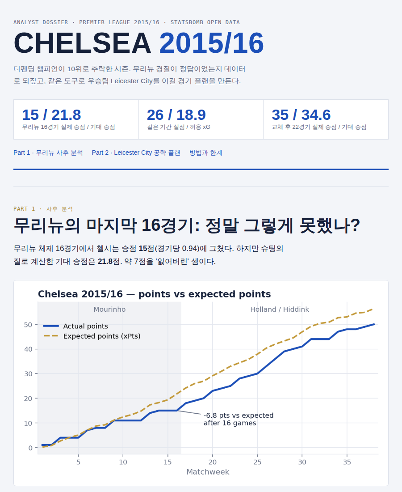
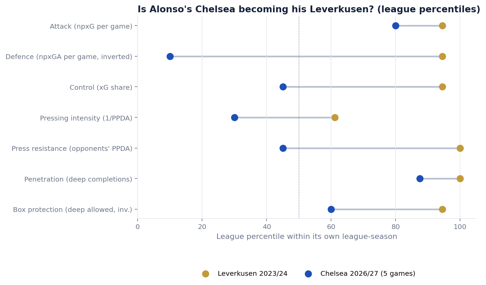
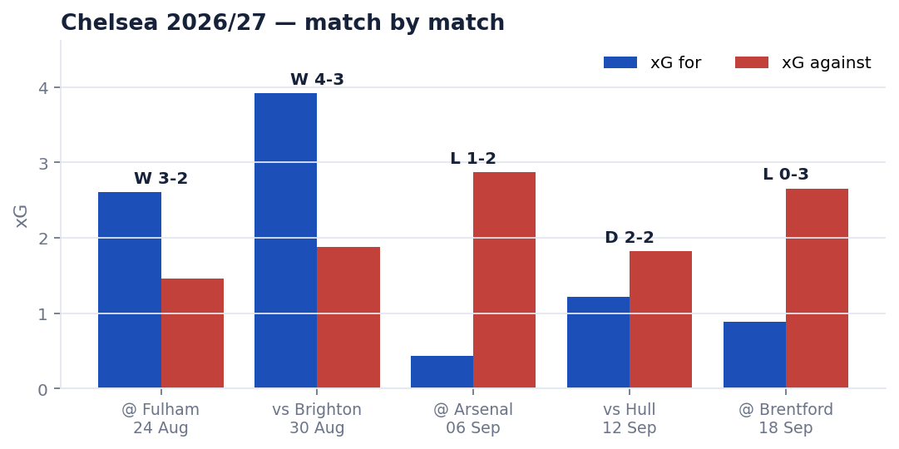

# chelsea-analytics

**Football data analysis that ends in a game plan, not just a chart.**
Event and shot data → team diagnosis → opponent scouting rules → an ordered match plan a coach could act on.
Built around Chelsea, but every module works for any Premier League team.

| Module | Question | Data |
|---|---|---|
| **Season post-mortem** | Was Mourinho's 2015/16 Chelsea really a 10th-place team? | StatsBomb open event data, all 380 PL 2015/16 matches |
| **Opponent game plan** | How do we beat Leicester (or anyone)? | same |
| **Live dossier** | How are Chelsea doing this season, and how do we beat the next opponent? | Understat shot-level xG, EPL 2026/27 |
| **Manager fingerprint** | How close is Alonso's Chelsea to his Leverkusen? | Understat team metrics as league percentiles |
| **League translation** | How much of a player's output survives a move to the EPL? | 800 league-to-league moves, 2014/15–2024/25 |

## Selected results

**1. The 2015/16 collapse was mostly bad luck, but not only that.**
Mourinho's 16 games produced 15 points from 21.8 expected points, with 26 goals conceded from 18.9 xG against.
Underneath, the attack was the structural problem. Chelsea had high field tilt (62%) but below-average open-play xG (0.60 vs 0.70), so they had the ball and did little with it.



**2. Alonso's Chelsea after 5 games: the attack is already there, the control isn't.**
Seven team metrics, each converted to a percentile within its own league so the EPL and Bundesliga are comparable.
Attack (80th vs 94th) and penetration (88th vs 100th) are close to 2023/24 Leverkusen.
Defence (10th vs 94th), control (45th vs 94th) and press resistance (45th vs 100th) are far off.



**3. Match by match, 2026/27:** Chelsea dominated the first two games (xG 3.26 vs 1.67), then were out-created in the next three (0.84 vs 2.45).
Two more weaknesses show up. Set-piece xG against is 0.50 per game (league average 0.39). And 44% of the xG they concede at level score comes after the 60th minute (league average 20%).



**4. League translation:** non-EPL attackers keep roughly 88–94% of their per-90 npxG and 87–96% of their xA after moving to the Premier League, once regression to the mean is separated out.
The model beats a no-translation baseline by 6% (npxG) and 9% (xA) in 10-fold cross-validation.

## How the game plan is generated

1. **Profile every team** on league percentiles: xG by origin (open play, set piece, crosses, through balls, counters), PPDA, deep completions, game state, and aerial threat.
2. **Scouting rules** turn extremes into findings, and each finding carries its evidence, an action, and a counter-risk.
   Example (Leicester 2015/16): *"34% of the xG they concede at level score comes after 60' (league 27%, rank 1/20) → bring fresh attackers on around the hour and make the last 30 minutes the decisive phase"*.
   Rules based on season averages (set pieces, deep completions) must also hold on a trimmed mean, with each team's worst match dropped. That way one freak game can't create a finding.
3. **Matchup:** our strengths are cross-checked against their weaknesses, and theirs against ours.
4. **Plan:** the 3–5 highest-scoring items, in order.

The rules are a starting point for a coach, not a replacement for video work.

## Run it

```bash
pip install -r requirements.txt
export PYTHONPATH=src

python -m cfc.report                          # 2015/16 dossier -> reports/chelsea_2015_16_dossier.html
python -m cfc.report --opponent "Arsenal"     # game plan against any 2015/16 PL team
python -m cfc.live --fetch                    # current season from Understat -> reports/chelsea_2026_27_live.html
python -m cfc.translation_report              # needs data/translation/ (see data/README.md)
python -m pytest -q tests                     # points must match the official 2015/16 table
```

The first run downloads about 100 MB of StatsBomb data (gzip-cached). Understat data isn't included in the repo; see [data/README.md](data/README.md).
The generated reports in `reports/` are in Korean. Charts and code are in English.

## Layout

```
src/cfc/
  data.py               StatsBomb loader + cache
  metrics.py            team-match metrics: xG by origin, PPDA, field tilt, game state, possession-level xPts
  scouting.py           scouting rules -> findings -> matchup -> game plan
  charts.py             matplotlib / mplsoccer figures
  report.py             2015/16 dossier (self-contained HTML)
  understat.py          Understat loader, mapped to the same schema so the scouting rules run unchanged
  live.py               current-season dossier + next-opponent plan
  fingerprint.py        manager fingerprint (league-percentile style vectors)
  translation.py        league translation model (fit, bootstrap CIs, cross-validation)
  translation_report.py recruitment shortlist report
tests/                  sanity checks against official results
```

## Method notes

- **xPts:** shots in the same possession are merged as `1 − Π(1 − xG)`, because rebounds aren't independent chances. Each possession is then simulated 10,000 times.
- **Late fade:** the share of xG conceded after 60', using only shots taken at a level score. This controls for teams that sit deep on a lead.
- **PPDA:** opponent passes in their own 60% of the pitch ÷ our tackles + interceptions + fouls in that zone. Lower means a more intense press.
- **Translation model:** `log(m_next + ε) = a + b·log(m_now + ε) + β_to − β_from`, with the EPL fixed at β = 0.
  Players who stayed in the same league identify `a` and `b` (regression to the mean). Players who moved identify the league effects `β`.
  Observations are weighted by minutes, and the CIs are bootstrapped.
- **Fingerprint similarity:** `1 − mean |Δ percentile|` over seven metrics: attack, defence, control, pressing, press resistance, penetration and box protection.

## Limits

These analyses use event and shot data only, with no tracking data and no video. The live samples are small (5 games), and the reports say so wherever it matters.

## Data & licence

- Code: MIT (see [LICENSE](LICENSE)), except the `llm-reliability/` folder, which from 2026-10-05 is all rights reserved (see [llm-reliability/LICENSE](llm-reliability/LICENSE)); earlier versions of that folder remain MIT.
- [StatsBomb Open Data](https://github.com/statsbomb/open-data): free for non-commercial use with attribution.
- [Understat](https://understat.com): personal / research use. Understat data is not redistributed here.

---
Made by **jw_football_data**, a big-data student in Korea who is learning to turn numbers into match plans.
Roadmap: [ROADMAP.md](ROADMAP.md)
