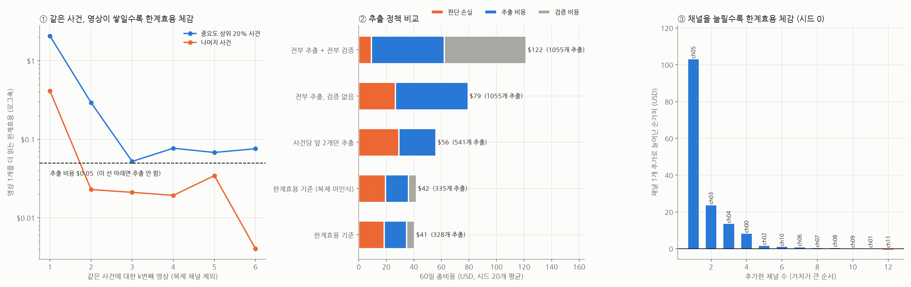

# 한계효용 기반 추출 (가상 데이터)

규칙은 하나입니다: **다음 한 단위의 한계효용 > 그 단위의 비용**일 때만 처리합니다.

| 단계 | 한 단위 | 한계효용 | 비용 |
|---|---|---|---|
| 영상 추출 | 새 영상 1개 | 관련 확률 × 그 영상이 줄여줄 불확실성 (중요도 × p(1-p)의 기대 감소) | $0.05 |
| 원문 검증 | 사건 1개 | 검증 성공률 × 남은 불확실성 전부 | $0.40 |
| 채널 구독 | 채널 1개 | 그 채널을 넣었을 때 늘어나는 순가치 | (감시 비용) |

설정: 60일, 업데이트 사건 300개(절반이 관심 주제, 20%는 루머), 채널 12개 중 3개는 다른 채널을 베낌(ch09→ch00, ch10→ch01, ch11→ch00).

## 정책 비교 (시드 20개 평균)

| 정책 | 추출한 영상 | 추출 비용 | 검증 비용 | 판단 손실 | 총비용 | 놓친 사실 사건 |
|---|---|---|---|---|---|---|
| 전부 추출 + 전부 검증 | 1055 | $52.77 | $59.54 | $9.22 | $121.54 | 2.5 |
| 전부 추출, 검증 없음 | 1055 | $52.77 | $0.00 | $26.64 | $79.41 | 2.5 |
| 사건당 앞 2개만 추출 | 541 | $27.06 | $0.00 | $29.10 | $56.16 | 2.5 |
| 한계효용 기준 (복제 미인식) | 335 | $16.76 | $5.82 | $19.36 | $41.94 | 3.2 |
| 한계효용 기준 | 328 | $16.40 | $5.78 | $18.40 | $40.58 | 3.2 |

- 한계효용 기준이 총비용 최저였던 시드: 75%
- 관심 사건에 대한 영상 중 복제 채널 영상 비율: 23% (한계효용 0으로 처리)

## k번째 영상의 평균 한계효용 (시드 0, 복제 제외)

| k번째 | 중요도 상위 20% 사건 | 나머지 사건 |
|---|---|---|
| 1.0 | $2.067 | $0.413 |
| 2.0 | $0.293 | $0.023 |
| 3.0 | $0.052 | $0.021 |
| 4.0 | $0.077 | $0.019 |
| 5.0 | $0.068 | $0.034 |
| 6.0 | $0.076 | $0.004 |

## 채널 추가 순서와 한계 순가치 (시드 0)

| 순서 | 채널 | 누적 순가치 | 한계 순가치 | 신뢰도 | 관심 사건 커버율 | 베끼는 대상 |
|---|---|---|---|---|---|---|
| 1 | ch05 | $102.91 | $102.91 | 0.88 | 0.53 | - |
| 2 | ch03 | $126.56 | $23.65 | 0.79 | 0.28 | - |
| 3 | ch04 | $140.01 | $13.45 | 0.83 | 0.29 | - |
| 4 | ch00 | $148.15 | $8.14 | 0.74 | 0.39 | - |
| 5 | ch02 | $149.73 | $1.58 | 0.72 | 0.35 | - |
| 6 | ch10 | $150.75 | $1.02 | 0.91 | 0.26 | ch01 |
| 7 | ch06 | $151.51 | $0.76 | 0.72 | 0.22 | - |
| 8 | ch07 | $151.77 | $0.26 | 0.64 | 0.19 | - |
| 9 | ch08 | $152.16 | $0.39 | 0.70 | 0.27 | - |
| 10 | ch09 | $152.19 | $0.03 | 0.80 | 0.41 | ch00 |
| 11 | ch01 | $152.15 | $-0.05 | 0.85 | 0.16 | - |
| 12 | ch11 | $151.61 | $-0.53 | 0.84 | 0.43 | ch00 |
