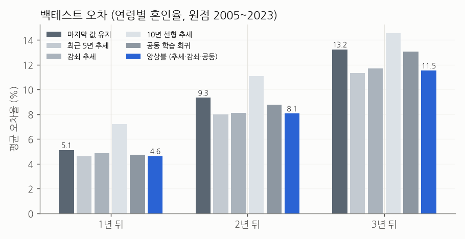
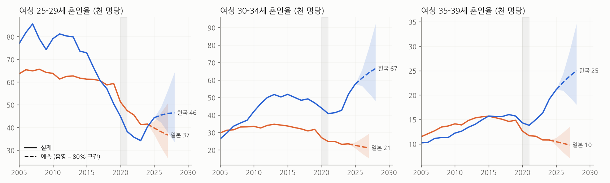

# 연령별 혼인율 예측 모델

공식 통계(KOSIS·e-Stat)로 학습한 예측입니다. 계열 24개 (한·일 × 남녀 × 연령대 5개 혼인율 + 평균 초혼연령), 2000년부터.

## 1. 모델 비교 (롤링 원점 백테스트)

원점 연도 T까지의 자료만 보고 T+1~T+3년을 맞히게 한 뒤 실제 값과 비교했습니다 (원점 2005~2023).

| 모델 | 1년 뒤 | 2년 뒤 | 3년 뒤 | 1년 뒤 (코로나 제외) | 2년 뒤 (코로나 제외) | 3년 뒤 (코로나 제외) |
|---|---|---|---|---|---|---|
| 마지막 값 유지 | 5.1% | 9.3% | 13.2% | 4.2% | 7.6% | 11.4% |
| 최근 5년 추세 | 4.6% | 8.0% | 11.3% | 4.2% | 6.9% | 10.4% |
| 감쇠 추세 | 4.9% | 8.1% | 11.7% | 4.2% | 6.8% | 10.3% |
| 10년 선형 추세 | 7.2% | 11.1% | 14.5% | 5.9% | 9.4% | 12.5% |
| 공동 학습 회귀 | 4.7% | 8.8% | 13.1% | 4.2% | 7.4% | 11.6% |
| 앙상블 (추세·감쇠·공동) | 4.6% | 8.1% | 11.5% | 4.1% | 6.8% | 10.2% |

- 쓴 모델(앙상블)은 '마지막 값 유지'보다 오차가 1년 뒤 10%, 3년 뒤 13% 작습니다. **개선 폭이 크지 않습니다.** 혼인율은 정책·경기·코로나 같은 바깥 충격이 크고, 과거 숫자만으로는 그 충격을 알 수 없기 때문입니다.
- 평균 초혼연령은 훨씬 잘 맞습니다 (3년 뒤도 오차 0.6% 안팎, 약 0.2세). 천천히 움직이는 지표라서입니다.

| 모델 (초혼연령) | 1년 뒤 | 2년 뒤 | 3년 뒤 | 1년 뒤 (코로나 제외) | 2년 뒤 (코로나 제외) | 3년 뒤 (코로나 제외) |
|---|---|---|---|---|---|---|
| 마지막 값 유지 | 0.47% | 0.84% | 1.22% | 0.47% | 0.89% | 1.29% |
| 최근 5년 추세 | 0.27% | 0.48% | 0.63% | 0.24% | 0.45% | 0.64% |
| 감쇠 추세 | 0.26% | 0.42% | 0.52% | 0.23% | 0.40% | 0.54% |
| 10년 선형 추세 | 0.57% | 0.81% | 1.05% | 0.56% | 0.81% | 1.05% |
| 공동 학습 회귀 | 0.30% | 0.57% | 0.85% | 0.25% | 0.48% | 0.79% |
| 앙상블 (추세·감쇠·공동) | 0.26% | 0.46% | 0.57% | 0.22% | 0.41% | 0.55% |

## 2. 모델 고르기도 검증

| 예측 거리 | ~2014 성적으로 고른 모델 | 고른 모델의 이후 오차 | 이후 가장 좋았던 모델 | 그 모델의 이후 오차 | naive 이후 오차 |
|---|---|---|---|---|---|
| 1년 | ensemble | 5.3% | drift | 5.3% | 6.0% |
| 2년 | damped | 9.8% | drift | 9.5% | 11.2% |
| 3년 | damped | 14.3% | drift | 13.4% | 15.6% |

- 2014년까지 성적으로 고른 모델이 2015년 이후에도 상위권이었지만, 1등은 아니었습니다 (차이 0.1~0.9%p). 실제 경기 데이터의 라우터 실험과 같은 결론입니다: **앞 구간 1등이 뒤 구간 1등이라는 보장은 없고, 차이가 작으면 단순하고 안정적인 쪽을 쓰는 게 낫다.** 그래서 한 모델을 고르지 않고 세 모델 평균(앙상블)을 씁니다.

## 3. 예측 구간은 믿을 만한가

| 예측 거리 | 목표 | 보정 전 포함률 | 고른 배수 k | 보정 후 포함률 (이후 원점) | 판정 수 |
|---|---|---|---|---|---|
| 1년 | 80% | 78% | 1.0 | 72% | 200 |
| 2년 | 80% | 64% | 1.0 | 57% | 210 |
| 3년 | 80% | 54% | 1.0 | 50% | 210 |

- 과거 오차를 그대로 써서 만든 80% 구간은 실제로 54~78%만 담았습니다. **구간이 너무 좁았습니다.** 2년·3년 뒤일수록 심합니다.
- 2014년 이전(조용했던 시기)에서 배수를 고르면 k = 1로 충분해 보였지만, 이후(코로나, 한국 2024~25 급반등)에는 50~73%로 떨어졌습니다. 조용한 시기의 오차로는 다음 충격의 크기를 알 수 없다는 뜻입니다.
- 그래서 최종 구간은 전체 기간으로 배수를 다시 맞췄습니다 (1년 1.05배, 2년 1.55배, 3년 1.75배). 이 배수도 지난 20년 기준이라 **다음 충격이 더 크면 여전히 좁을 수 있습니다.** 정답이 나올 때마다 포함률을 다시 잽니다.

## 4. 예측

### 다음 해 (여성)

| 나라 | 지표 | 최근 실제 | 예측 연도 | 예측 (80% 구간) | 정답 공개 |
|---|---|---|---|---|---|
| JP | 초혼연령  | 29.8 (2024) | 2025 | 29.8 (29.7~29.9) | 2026-09 |
| JP | 혼인율 20-24 | 15.5 (2024) | 2025 | 14.6 (13.5~15.7) | 2026-09 |
| JP | 혼인율 25-29 | 41.5 (2024) | 2025 | 39.8 (36.9~42.8) | 2026-09 |
| JP | 혼인율 30-34 | 23.5 (2024) | 2025 | 22.6 (21.0~24.4) | 2026-09 |
| JP | 혼인율 35-39 | 10.8 (2024) | 2025 | 10.4 (9.7~11.2) | 2026-09 |
| JP | 혼인율 40-44 | 4.5 (2024) | 2025 | 4.3 (4.0~4.6) | 2026-09 |
| KR | 초혼연령  | 31.6 (2025) | 2026 | 31.8 (31.6~31.9) | 2027-03 |
| KR | 혼인율 20-24 | 7.6 (2025) | 2026 | 7.7 (7.1~8.2) | 2027-03 |
| KR | 혼인율 25-29 | 44.3 (2025) | 2026 | 45.4 (42.2~49.0) | 2027-03 |
| KR | 혼인율 30-34 | 57.6 (2025) | 2026 | 61.1 (56.7~65.8) | 2027-03 |
| KR | 혼인율 35-39 | 21.1 (2025) | 2026 | 22.6 (20.9~24.3) | 2027-03 |
| KR | 혼인율 40-44 | 6.5 (2025) | 2026 | 6.6 (6.2~7.1) | 2027-03 |

### 3년 뒤 (여성 혼인율)

| 나라 | 지표 | 예측 연도 | 예측 (80% 구간) |
|---|---|---|---|
| JP | 혼인율 20-24 | 2027 | 12.9 (9.3~17.8) |
| JP | 혼인율 25-29 | 2027 | 36.6 (26.5~50.7) |
| JP | 혼인율 30-34 | 2027 | 21.2 (15.3~29.3) |
| JP | 혼인율 35-39 | 2027 | 9.8 (7.1~13.5) |
| JP | 혼인율 40-44 | 2027 | 4.0 (2.9~5.5) |
| KR | 혼인율 20-24 | 2028 | 7.6 (5.5~10.5) |
| KR | 혼인율 25-29 | 2028 | 46.5 (33.6~64.3) |
| KR | 혼인율 30-34 | 2028 | 66.5 (48.1~92.0) |
| KR | 혼인율 35-39 | 2028 | 25.0 (18.1~34.6) |
| KR | 혼인율 40-44 | 2028 | 6.8 (4.9~9.4) |

- 한국: 30~34세 혼인율이 계속 오르는 쪽(2028년 66.5, 구간 48~92)입니다. 구간이 넓습니다. 최근 2년의 급반등이 추세에 반영된 결과라, 반등이 정책 효과로 일시적이면 크게 빗나갈 수 있습니다.
- 일본: 모든 연령대에서 완만한 감소가 이어집니다 (25~29세 41.5 → 2027년 36.6).
- 초혼연령: 한국 여성 2028년 32.1세, 일본 2027년 29.9세. 격차는 계속 벌어집니다.

## 5. 선행 신호 대조 (예측 vs 이미 수집한 보도 수치)

- **일본 2025년**: 모델은 여성 25~39세 혼인율이 평균 -3.7% 변한다고 봅니다. 그런데 수집해 둔 공식 발표(주장 DB)에 따르면 2025년 혼인 건수는 **+0.8%** (48만 9,119건)였습니다. 젊은 여성 인구가 해마다 1~2%씩 줄어드는 것을 감안하면 율은 오히려 소폭 올랐을 가능성이 큽니다. **모델이 일본 2025년을 낮게 볼 가능성이 있습니다.** 2026년 9월 확정치로 채점됩니다.
- **한국 2026년**: 모델은 +5.2%를 예상합니다. 2026년 2분기 혼인 +4.9%, 7월 +9.3%(주장 DB)와 방향이 같습니다.
- 이 대조가 한계효용 엔진의 다음 단계입니다. 과거 숫자만 보는 모델은 바깥 충격을 모르고, 그 해 월별·분기 발표 같은 **새 정보가 예측을 가장 크게 바꾸는 자료**입니다 (한계효용이 큼).

## 6. 채점 루프

- 예측은 `data_forecast/forecasts_2026-10-04.csv`에 저장됩니다 (계열·연도·예측·구간·정답 공개 예정일).
- 새 공식 값이 나오면 `python official_demo.py`로 받고 `llmrel.forecast.score_forecasts()`로 채점합니다: 오차율과 구간 포함 여부가 기록되고, 아직 안 나온 값은 pending으로 남습니다. 앞서 만든 예측 로그(predictions → outcomes) 구조와 같습니다.

## 한계

- 인구 구조(연령대 인구), 경기, 주거비, 정책 같은 설명 변수는 넣지 않았습니다. 과거 값의 패턴만 씁니다.
- 연령별 '혼인율'이라 미혼율과는 다릅니다. 미혼율 예측은 5년 주기 자료라 표본이 너무 적어 이번에는 하지 않았습니다.
- 한국·일본은 혼인율 정의가 조금 달라 수준 비교보다 각 나라 안의 변화로 읽어야 합니다.