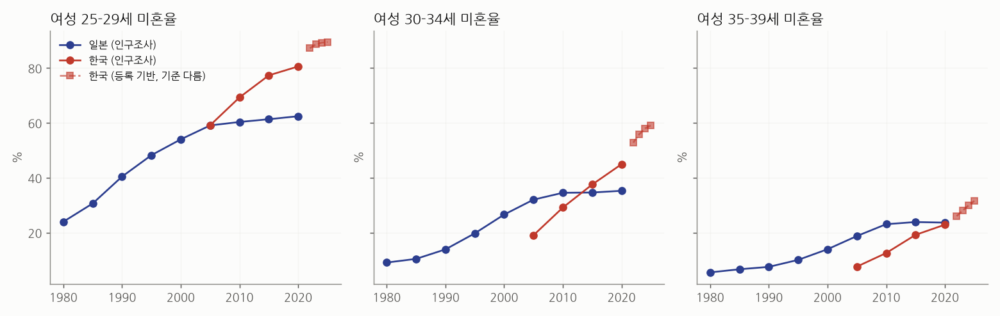
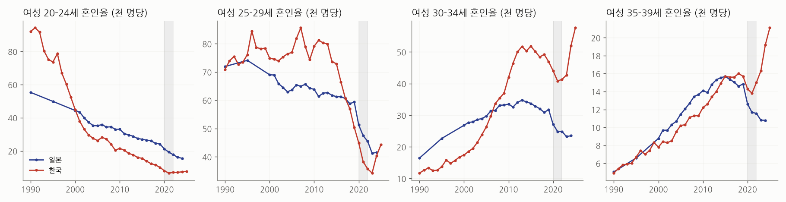
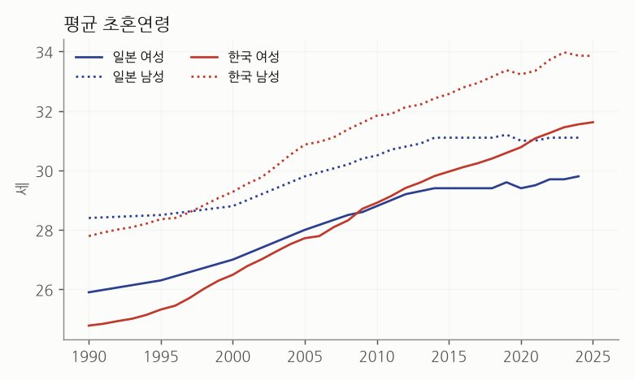

# 한국·일본 여성 연령대별 결혼 지표 (공식 통계 API)

KOSIS(통계청)와 e-Stat(일본 총무성 통계국) API에서 직접 받은 값입니다. 기사나 2차 자료를 거치지 않았습니다.

## 수집 결과

| collector | ok | rows | years |
|---|---|---|---|
| 저장된 CSV | True | 0 |  |

전체 1,718행 → `data_official/kr_jp_marriage_official.csv` (열마다 출처 표 번호와 집계 기준 포함)

## 1. 미혼율 — 같은 기준(인구조사)끼리 비교

| 연령 | 한국 2005 | 한국 2020 | 한국 변화(%p/년) | 일본 2005 | 일본 2020 | 일본 변화(%p/년) | 2020 격차(한-일) | 한국 등록 2022→2025(%p/년) |
|---|---|---|---|---|---|---|---|---|
| 25-29 | 59.1 | 80.6 | 1.4 | 59.1 | 62.4 | 0.2 | 18.1 | 0.7 |
| 30-34 | 19.1 | 45.0 | 1.7 | 32.0 | 35.2 | 0.2 | 9.7 | 2.1 |
| 35-39 | 7.6 | 22.9 | 1.0 | 18.8 | 23.6 | 0.3 | -0.7 | 1.8 |

- 한국 여성 30대 초반 미혼율은 2005년 일본보다 13%p 낮았지만 2015년 무렵 역전했고, 2020년에는 10%p 높습니다.
- 2005→2020 사이 한국은 연령대마다 해마다 1.0~1.7%p씩 올랐고, 일본은 0.2~0.3%p로 거의 멈췄습니다. **한국이 일본보다 3~8배 빠르게 변했습니다.**
- 35~39세는 2020년에 두 나라가 거의 같아졌습니다(한국 22.9%, 일본 23.6%). 30대 후반까지 미혼 비율이 일본 수준을 따라잡았다는 뜻입니다.
- 한국 2022년 이후 값(점선)은 **혼인신고 기준 등록 자료**라 인구조사(본인 응답)와 기준이 다릅니다. 30~34세에서 2020→2022 사이 7.9%p가 한 번에 뛴 것은 실제 변화보다 기준 차이가 큽니다. 그래서 등록 자료끼리의 추세(표의 마지막 열)만 따로 봅니다.
- 일본은 2025년 국세조사 결과가 아직 API에 없어 2020년이 최신입니다.

## 2. 연령별 혼인율 — 코로나 이후 반등이 어디서 일어나나

| 연령 | 나라 | 2019 | 최저(연도) | 최신 | 2019 대비 | 최저 대비 반등 |
|---|---|---|---|---|---|---|
| 20-24 | 한국 | 10.1 | 6.6 (2021) | 7.6 (2025) | -25% | +15% |
| 20-24 | 일본 | 24.1 | 15.5 (2024) | 15.5 (2024) | -36% | +0% |
| 25-29 | 한국 | 50.4 | 34.2 (2023) | 44.3 (2025) | -12% | +30% |
| 25-29 | 일본 | 59.4 | 41.2 (2023) | 41.5 (2024) | -30% | +1% |
| 30-34 | 한국 | 46.9 | 40.8 (2021) | 57.6 (2025) | +23% | +41% |
| 30-34 | 일본 | 31.8 | 23.2 (2023) | 23.5 (2024) | -26% | +1% |
| 35-39 | 한국 | 15.7 | 13.8 (2021) | 21.1 (2025) | +34% | +53% |
| 35-39 | 일본 | 14.8 | 10.8 (2024) | 10.8 (2024) | -27% | +0% |

- 한국의 반등은 **30~34세에 몰려 있습니다.** 2019년 수준을 이미 넘었고, 25~29세는 최저점 대비 크게 회복했지만 아직 2019년보다 낮습니다.
- 일본은 모든 연령대에서 2019년보다 26~36% 낮고, 2023→2024는 거의 그대로입니다. 반등 신호가 없습니다.
- 혼인의 중심 연령도 다릅니다. 일본은 여전히 25~29세가 가장 높고, 한국은 2021년부터 30~34세가 25~29세를 앞질렀습니다.
- 기준 차이: 한국은 '그 해 신고된 혼인, 혼인 당시 연령', 일본은 '그 해 동거를 시작하고 신고한 혼인, 동거 시작 연령'입니다. 일본 쪽이 조금 낮게 나오는 정의라, 수준 비교보다 **변화율 비교**가 안전합니다.

## 3. 평균 초혼연령

| 연도 | 한국 여성 | 일본 여성 | 한국 남성 | 일본 남성 |
|---|---|---|---|---|
| 1990 | 24.8 | 25.9 | 27.8 | 28.4 |
| 2000 | 26.5 | 27.0 | 29.3 | 28.8 |
| 2010 | 28.9 | 28.8 | 31.8 | 30.5 |
| 2020 | 30.8 | 29.4 | 33.2 | 31.0 |
| 2024 | 31.6 | 29.8 | 33.9 | 31.1 |
| 2025 | 31.6 | - | 33.9 | - |

- 한국 여성의 초혼연령은 2009~2010년 무렵 일본을 넘어섰고, 2024년에는 약 1.8세 많습니다. 일본은 2015년 이후 29세대에 멈춰 있고 한국은 계속 오릅니다.

## 요약: 가장 큰 차이

1. **변화 속도** — 같은 기간 한국 여성의 연령대별 미혼율은 일본보다 3~8배 빠르게 올랐다. 일본은 이미 고원(plateau), 한국은 아직 상승 중.
2. **결혼 시점** — 한국은 혼인이 30대 초반으로 옮겨 갔고, 최근 반등도 그 연령에서 일어난다. 일본은 20대 후반 중심이 유지되지만 전 연령에서 줄고 있다.
3. **최근 방향** — 한국은 2023년 이후 30대 혼인율이 오르는데 같은 기간 미혼율(등록 기준)도 오른다. 늦게 결혼하는 사람이 늘어난 것이지 미혼 증가가 멈춘 것은 아니다. 일본은 반등 없이 낮은 수준이 굳어지고 있다.

## 한계

- 연애(교제) 여부는 두 나라 모두 공식 연간 통계가 없습니다. 일본 출생동향기본조사(5년 주기)·한국 가족과 출산 조사가 있지만 API로 받을 수 있는 표가 아니어서 이번 수집에서 빠졌습니다.
- 한국 2020년 미혼율은 같은 구성의 표(DT_1PM2003)를 API가 거부해 출생지 유형 표(DT_1PB2004)의 합계를 썼습니다. 이 표는 15~24세가 한 구간이라 25세 이상만 사용했습니다.
- 일본 미혼율은 외국인 포함·배우관계 불상 제외, 한국은 내국인 기준입니다.