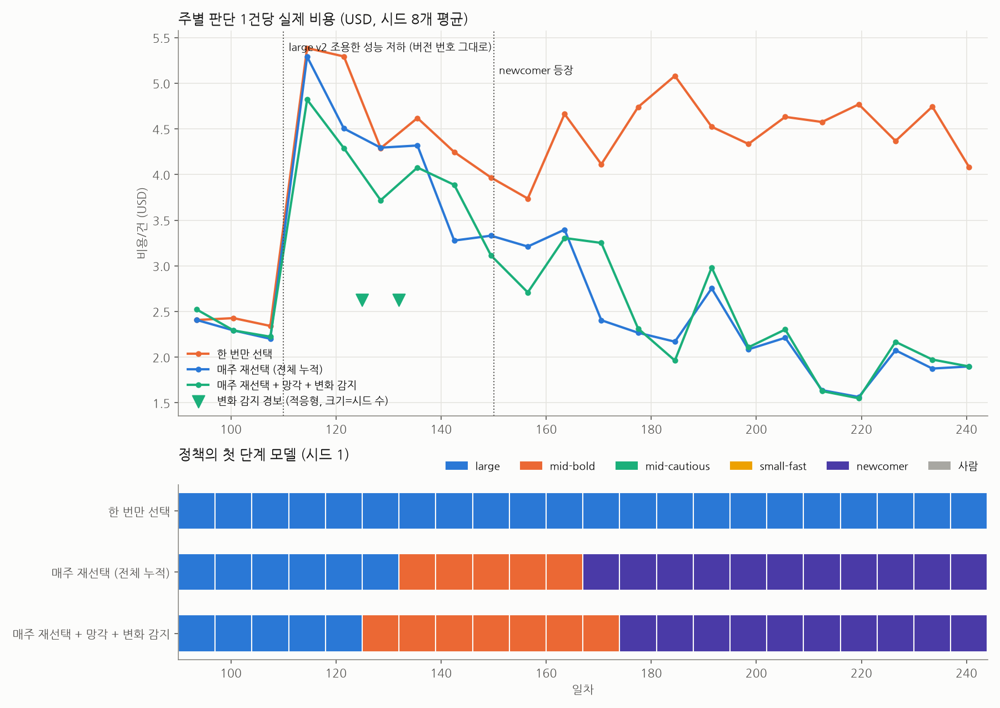

# 온라인 업데이트 시나리오 (가상 데이터)

매주 그 시점까지 **정답이 확정된 데이터만** 보고 프로파일과 라우팅 정책을 갱신합니다. 정답은 평균 2주 늦게 확정됩니다.

| 일차 | 사건 |
|---|---|
| 60 | large v1→v2 (공지된 버전 교체) |
| 110 | large v2 조용한 성능 저하 (버전 번호 그대로) |
| 150 | newcomer 등장 |

## 기간별 판단 1건당 평균 비용 (시드 8개)

| 전략 | 정상 (90~110일) | 조용한 성능 저하 후 (110~150일) | 신규 모델 등장 후 (150~240일) | 전체 |
|---|---|---|---|---|
| 한 번만 선택 | $2.39 | $4.63 | $4.49 | $4.24 |
| 매주 재선택 (전체 누적) | $2.30 | $4.17 | $2.27 | $2.79 |
| 매주 재선택 + 망각 + 변화 감지 | $2.35 | $3.98 | $2.32 | $2.78 |

- 적응형이 전체 누적보다 비용이 낮았던 시드: 5/8

## 변화 감지 경보 (적응형)

| 모델 | 방향 | 경보_시드수 | 첫경보_중앙값 | 기준_확신오답률 | 경보주_확신오답률 |
|---|---|---|---|---|---|
| large@v2 | 악화 | 8 | 128일 | 12.6% | 25.8% |
