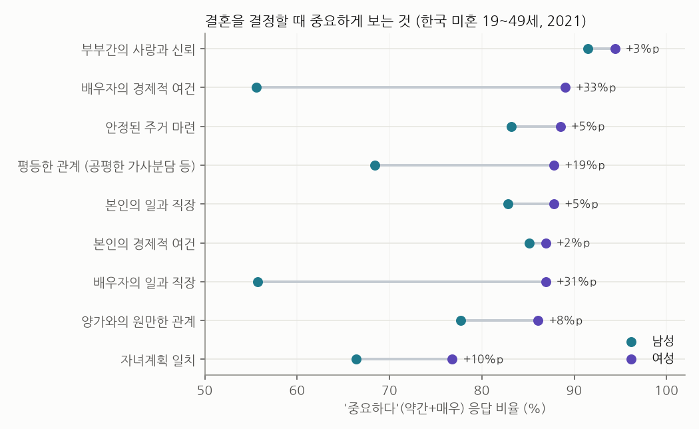
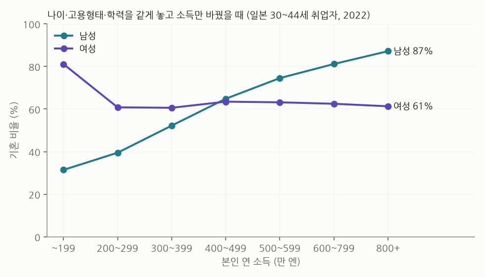
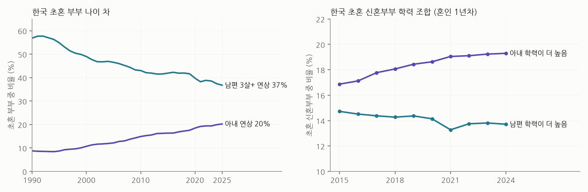

# 결혼할 때 무엇을 보나: 말 vs 실제

두 가지를 나란히 봅니다. **말하는 기준**은 설문에서 직접 물은 결과, **실제로 드러나는 기준**은 어떤 조건의 사람이 실제로 결혼해 있는지입니다.

> 읽기 전에: 결혼 여부는 두 사람의 선택, 그리고 본인이 '결혼할 여건이 된다'고 느끼는지가 함께 만든 결과입니다. 아래 '실제' 수치를 여성의 선택만으로 해석할 수 없습니다. 모두 집단 통계이고 개인에 대한 판단이 아닙니다.

## 1. 말: 결혼 결정 때 중요하게 보는 것 (한국, 2021)

보건사회연구원 가족과 출산 조사, 미혼 19~49세 (여성 2,400명, 남성 3,649명).

| 항목 | 여성 중요 | 남성 중요 | 차이 (여−남) | 여성 '매우' 중요 |
|---|---|---|---|---|
| 배우자의 경제적 여건 | 89.0 | 55.6 | 33.4 | 45.4 |
| 배우자의 일과 직장 | 86.9 | 55.7 | 31.2 | 43.7 |
| 평등한 관계 (공평한 가사분담 등) | 87.8 | 68.4 | 19.4 | 51.6 |
| 자녀계획 일치 | 76.8 | 66.4 | 10.4 | 41.7 |
| 양가와의 원만한 관계 | 86.1 | 77.7 | 8.4 | 50.5 |
| 안정된 주거 마련 | 88.5 | 83.2 | 5.3 | 50.0 |
| 본인의 일과 직장 | 87.8 | 82.8 | 5.0 | 43.6 |
| 부부간의 사랑과 신뢰 | 94.4 | 91.5 | 2.9 | 73.2 |
| 본인의 경제적 여건 | 86.9 | 85.1 | 1.8 | 46.4 |

- 여성은 9개 항목 중 8개를 85% 넘게 '중요하다'고 답했습니다. 1위는 **사랑과 신뢰 (94%)**입니다.
- 남녀 차이가 가장 큰 것은 **배우자의 경제적 여건 (여성 89% vs 남성 56%)**과 **배우자의 일과 직장 (87% vs 56%)**입니다. 그다음이 **평등한 관계(가사 분담)**입니다 (88% vs 68%).
- '매우 중요' 기준으로는 여성의 배우자 경제적 여건이 45%입니다.
- 남성도 **본인의** 경제적 여건은 85%가 중요하다고 답합니다. 남성 스스로 '돈이 준비돼야 결혼한다'고 보는 것입니다.

## 2. 실제: 조건이 같을 때 소득만 다르면 (일본, 2022)

한국에는 성·나이·소득·고용형태·학력을 한꺼번에 나눈 공개 표가 없어 일본 취업구조기본조사를 썼습니다. 30~44세 **취업자** (남성 942만 명, 여성 800만 명 추정치, 겹치지 않는 칸 301·271개). 가중 로지스틱 회귀로 '다른 조건은 그대로 두고 하나만 바꿨을 때' 기혼 비율을 계산했습니다 (칸별 실제값과 평균 오차 3.2%p·3.8%p).

| 조건 | 남성: 가장 낮은~높은 칸 차이 | 여성: 가장 낮은~높은 칸 차이 |
|---|---|---|
| 본인 소득 | 56%p | 21%p |
| 고용형태 | 28%p | 8%p |
| 학력 | 19%p | 4%p |
| 나이 | 13%p | 17%p |

- **남성은 소득이 결혼과 가장 강하게 연결됩니다.** 연 200만 엔 미만 31% → 300만엔대 52% → 500만엔대 75% → 800만 엔 이상 87%.
- **고용형태도 남성에게만 차이가 납니다.** 같은 소득·학력이어도 비정규직은 정규직보다 19%p 낮습니다. 30~34세 원자료로는 남성 정규직 56%, 비정규직 20%입니다.
- **학력은 소득을 고정하면 오히려 반대입니다.** 대학원졸 남성 53%, 고졸 66%. 학력 자체보다 학력이 가져오는 소득·안정성이 작동한다는 뜻입니다.
- **여성은 소득·고용형태와 거의 무관합니다** (200만 엔 이상 구간 60~64%). 소득 200만 엔 미만 여성의 기혼 비율이 높은 것(81%)은 결혼·출산 뒤 시간제로 일하는 경우가 많아서 생긴 **역방향 관계**로 보입니다.
- 해석 주의: 남성도 결혼 뒤 소득이 오르는 효과(나이·책임감·회사 처우)가 섞여 있어, 이 차이 전부를 '소득이 높아서 결혼했다'로 볼 수 없습니다. 또 1절에서 보듯 남성 스스로 경제적 준비를 결혼 조건으로 보기 때문에, 저소득 남성의 낮은 기혼율에는 본인의 미루기도 들어 있습니다.

## 3. 실제: 한국 부부는 어떻게 맺어지나

- **아내가 연상인 초혼 부부: 9% (1990) → 20% (2025)**. 남편이 3살 이상 많은 부부는 57% → 37%로 줄었습니다. 나이는 점점 덜 따지는 조건입니다.
- **아내 학력이 더 높은 부부(19%)가 남편 학력이 더 높은 부부(14%)보다 많고**, 그 차이가 해마다 벌어집니다. 2024년 고졸 남편 + 대졸 아내 18,389쌍, 대졸 남편 + 고졸 아내 9,923쌍입니다. 여성의 대학 진학률이 남성을 넘어선 영향이 큽니다.

## 4. 종합: 여성의 평가 기준을 숫자로 정리하면

| 기준 | 말 (한국 여성 '중요' 비율) | 실제 결과에서 보이는 무게 |
|---|---|---|
| 사랑과 신뢰 | 94% (1위) | 통계로 잴 수 없음 |
| 배우자의 경제적 여건 | 89% (남성보다 +33%p) | **매우 큼**: 남성 소득 칸별 기혼율 56%p 차이 (일본) |
| 배우자의 일과 직장 | 87% (+31%p) | **큼**: 남성 비정규직 −19%p (소득 같아도) |
| 평등한 관계 (가사 분담) | 88% (+19%p) | 이번 자료로는 측정 불가 (시간사용조사로 다음 단계 가능) |
| 학력 | 설문 항목 없음 | **작음**: 아내 학력이 더 높은 결혼이 더 흔함. 소득을 고정하면 남성 학력이 높을수록 기혼율이 오히려 낮음 |
| 나이 (남편 연상) | 설문 항목 없음 | **줄어드는 중**: 아내 연상 결혼 20% |

말과 실제가 같은 방향을 가리키는 것은 **경제적 안정**입니다. 반대로 학력과 나이는 흔히 생각하는 것보다 덜 중요해졌습니다.

## 한계

- 설문(한국 2021)과 결과(일본 2022)는 나라가 다릅니다. 한국에서 같은 분석을 하려면 소득별 미혼율 표가 필요합니다 (통계청 신혼부부·인구주택총조사 마이크로데이터, API 비공개).
- 일본 자료는 **취업자만** 포함합니다. 일하지 않는 기혼 여성이 빠져 여성 기혼 비율은 실제보다 낮게 나옵니다.
- 설문 문항은 '결혼 결정 시 고려 정도'이지 '배우자 조건 순위'가 아닙니다. 외모·성격처럼 공식 통계에 없는 기준은 다루지 못합니다.
- 표본조사 추정치라 칸이 작은 곳(고소득 여성 등)은 흔들립니다.