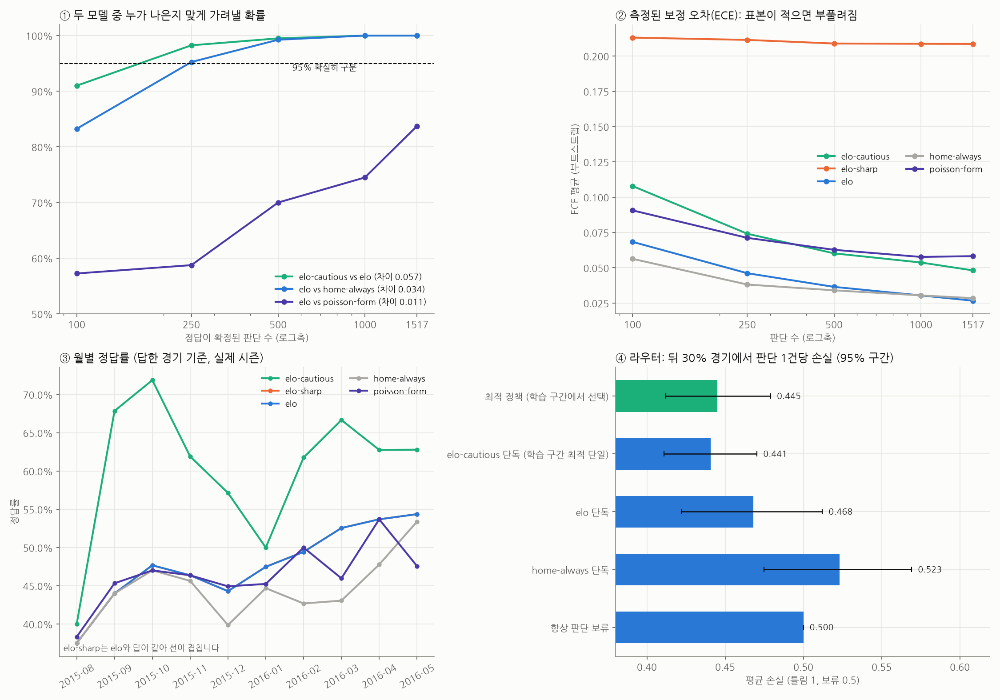

# 실제 데이터 검증: 실제 경기 결과로 신뢰도 프레임워크 시험

StatsBomb 공개 데이터, 2015/16 EPL·라리가·세리에 A·리그 1 **실제 경기 1,517개**. 예측 모델 5개가 매 경기 전에 그때까지의 결과만 보고 승/무/패와 확신도를 기록했고, 실제 결과를 정답으로 붙였습니다. 틀리면 손실 1, 판단 보류는 0.5입니다.

| 모델 | 방식 |
|---|---|
| home-always | 항상 홈승. 확신도 = 리그 홈승률 |
| elo | 엘로 레이팅 (시즌 첫 경기부터 학습) |
| elo-cautious | elo와 같지만 최고 확률 < 0.5 이면 기권 |
| elo-sharp | elo와 같은 답, 확신도만 일부러 부풀림 (과신 탐지 시험용) |
| poisson-form | 최근 6경기 득실로 포아송 예측 |

## 1. 전체 표본 프로필

| 모델 | 경기 | 정답 | 확신 오답 | 기권 | 답했을 때 정답률 | ECE | 기대 손실 |
|---|---|---|---|---|---|---|---|
| elo@v1 | 1517 | 47.9% | 52.1% | 0.0% | 47.9% | 0.024 | 0.521 |
| elo-cautious@v1 | 1517 | 19.8% | 12.5% | 67.8% | 61.3% | 0.045 | 0.463 |
| elo-sharp@v1 | 1517 | 47.9% | 52.1% | 0.0% | 47.9% | 0.207 | 0.521 |
| home-always@v1 | 1517 | 44.5% | 55.5% | 0.0% | 44.5% | 0.028 | 0.555 |
| poisson-form@v1 | 1517 | 46.9% | 53.1% | 0.0% | 46.9% | 0.057 | 0.531 |

## 2. 표본 수별 측정 정밀도 (95% 신뢰구간 반폭, 부트스트랩 400회)

| metric | model | 100 | 250 | 500 | 1000 | 1517 |
|---|---|---|---|---|---|---|
| ECE | elo-cautious@v1 | ±0.103 | ±0.069 | ±0.052 | ±0.039 | ±0.034 |
| ECE | elo-sharp@v1 | ±0.093 | ±0.058 | ±0.045 | ±0.030 | ±0.025 |
| ECE | elo@v1 | ±0.054 | ±0.037 | ±0.032 | ±0.022 | ±0.018 |
| ECE | home-always@v1 | ±0.063 | ±0.044 | ±0.036 | ±0.028 | ±0.023 |
| ECE | poisson-form@v1 | ±0.063 | ±0.045 | ±0.035 | ±0.028 | ±0.023 |
| accuracy_when_answering | elo-cautious@v1 | ±0.155 | ±0.111 | ±0.073 | ±0.053 | ±0.044 |
| accuracy_when_answering | elo-sharp@v1 | ±0.090 | ±0.062 | ±0.046 | ±0.031 | ±0.027 |
| accuracy_when_answering | elo@v1 | ±0.090 | ±0.062 | ±0.046 | ±0.031 | ±0.027 |
| accuracy_when_answering | home-always@v1 | ±0.090 | ±0.064 | ±0.044 | ±0.031 | ±0.025 |
| accuracy_when_answering | poisson-form@v1 | ±0.090 | ±0.064 | ±0.045 | ±0.031 | ±0.026 |
| confident_error_rate | elo-cautious@v1 | ±0.060 | ±0.044 | ±0.028 | ±0.020 | ±0.017 |
| confident_error_rate | elo-sharp@v1 | ±0.090 | ±0.062 | ±0.046 | ±0.031 | ±0.027 |
| confident_error_rate | elo@v1 | ±0.090 | ±0.062 | ±0.046 | ±0.031 | ±0.027 |
| confident_error_rate | home-always@v1 | ±0.090 | ±0.064 | ±0.044 | ±0.031 | ±0.025 |
| confident_error_rate | poisson-form@v1 | ±0.090 | ±0.064 | ±0.045 | ±0.031 | ±0.026 |
| expected_loss | elo-cautious@v1 | ±0.050 | ±0.036 | ±0.024 | ±0.017 | ±0.014 |
| expected_loss | elo-sharp@v1 | ±0.090 | ±0.062 | ±0.046 | ±0.031 | ±0.027 |
| expected_loss | elo@v1 | ±0.090 | ±0.062 | ±0.046 | ±0.031 | ±0.027 |
| expected_loss | home-always@v1 | ±0.090 | ±0.064 | ±0.044 | ±0.031 | ±0.025 |
| expected_loss | poisson-form@v1 | ±0.090 | ±0.064 | ±0.045 | ±0.031 | ±0.026 |

### 두 모델 중 누가 나은지 가려낼 수 있나

| N | 비교 | 전체 표본 차이 | 차이의 ± | 같은 결론 비율 |
|---|---|---|---|---|
| 100 | elo-cautious@v1 vs elo@v1 | -0.057 | ±0.078 | 91% |
| 100 | elo@v1 vs home-always@v1 | -0.034 | ±0.065 | 83% |
| 100 | elo@v1 vs poisson-form@v1 | -0.011 | ±0.080 | 57% |
| 250 | elo-cautious@v1 vs elo@v1 | -0.057 | ±0.053 | 98% |
| 250 | elo@v1 vs home-always@v1 | -0.034 | ±0.040 | 95% |
| 250 | elo@v1 vs poisson-form@v1 | -0.011 | ±0.054 | 59% |
| 500 | elo-cautious@v1 vs elo@v1 | -0.057 | ±0.040 | 100% |
| 500 | elo@v1 vs home-always@v1 | -0.034 | ±0.029 | 99% |
| 500 | elo@v1 vs poisson-form@v1 | -0.011 | ±0.038 | 70% |
| 1000 | elo-cautious@v1 vs elo@v1 | -0.057 | ±0.025 | 100% |
| 1000 | elo@v1 vs home-always@v1 | -0.034 | ±0.018 | 100% |
| 1000 | elo@v1 vs poisson-form@v1 | -0.011 | ±0.026 | 74% |
| 1517 | elo-cautious@v1 vs elo@v1 | -0.057 | ±0.020 | 100% |
| 1517 | elo@v1 vs home-always@v1 | -0.034 | ±0.017 | 100% |
| 1517 | elo@v1 vs poisson-form@v1 | -0.011 | ±0.021 | 84% |

## 3. 라우터 (앞 70% 경기로 선택 → 뒤 30% 경기로 검증)

| 정책 구분 | 정책 | 평균 손실 | 하한 | 상한 | 보류 비율 |
|---|---|---|---|---|---|
| 최적 정책 (학습 구간에서 선택) | poisson-form(≥0.60) → elo-sharp(≥0.70) → 사람 | 0.445 | 0.412 | 0.479 | 44% |
| elo-cautious 단독 (학습 구간 최적 단일) | elo-cautious(≥0.00) → 사람 | 0.441 | 0.411 | 0.470 | 56% |
| elo 단독 | elo(≥0.00) → 사람 | 0.468 | 0.422 | 0.512 | 0% |
| home-always 단독 | home-always(≥0.00) → 사람 | 0.523 | 0.475 | 0.569 | 0% |
| 항상 판단 보류 | (모델 없음) → 사람 | 0.500 | 0.500 | 0.500 | 100% |

- 최적 정책 − 최적 단일 모델: +0.0044 (95% 구간 -0.0121 ~ +0.0198), 최적 정책이 더 나을 확률 27%

## 4. 온라인 갱신 (시즌을 주 단위로 진행)

| 전략 | 평균손실 |
|---|---|
| 한 번만 선택 | 0.459 |
| 매주 재선택 (전체 누적) | 0.466 |
| 매주 재선택 + 망각 + 변화 감지 | 0.464 |

- 32주 × 3전략 동안 변화 감지 경보: 0건
