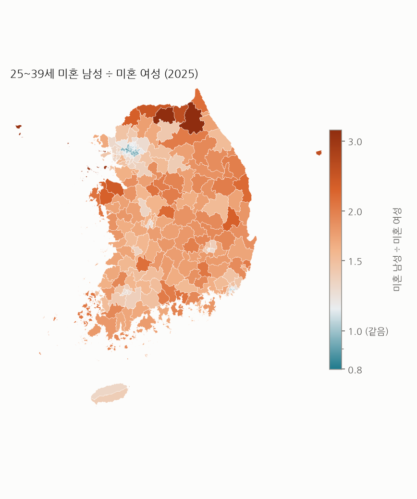
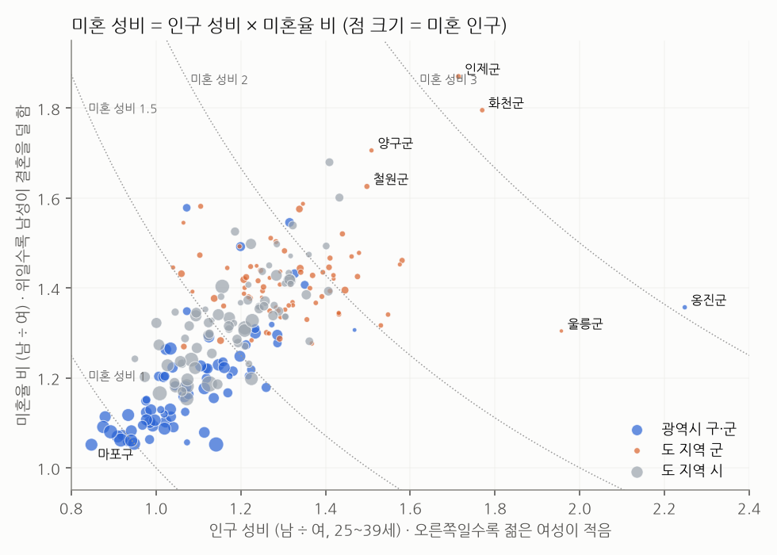

# 우리 동네 결혼 시장 성비 (2025, 시군구 229곳)

KOSIS 등록 기반 인구(내국인, 성·연령·혼인상태별, 시군구)로 계산했습니다. **미혼 성비 = 25~39세 미혼 남성 ÷ 미혼 여성**입니다. 1이면 같고, 2면 미혼 남성이 두 배입니다.

## 1. 전국: 나이가 많을수록 벌어진다

| 연령 | 미혼 남 ÷ 미혼 여 | 남는 미혼 남성 (명) | 여성 미혼율 | 남성 미혼율 |
|---|---|---|---|---|
| 20-24 | 1.10 | 115,224 | 99.0% | 99.6% |
| 25-29 | 1.16 | 215,210 | 89.5% | 95.0% |
| 30-34 | 1.42 | 400,329 | 59.1% | 74.8% |
| 35-39 | 1.67 | 305,338 | 31.5% | 48.4% |
| 40-44 | 1.72 | 241,547 | 19.1% | 31.4% |

- 25~39세 전체로 미혼 남성이 미혼 여성의 **1.33배**, 약 92만 명이 많습니다.
- 20대 초반엔 1.1배인데 30대 후반엔 1.67배입니다. 인구 성비(1.05~1.12)보다 훨씬 큰 차이라, 대부분은 '남성이 결혼을 덜 해서'입니다. 여성은 같은 또래 남성보다 평균 2~3살 위 남성과 결혼하는 경우가 많아, 같은 나이끼리 비교하면 여성 쪽 미혼율이 낮게 나오는 효과도 섞여 있습니다.
- 2022→2025년 전국 미혼 성비는 1.38 → 1.33로 **줄었습니다**. 시군구 86%에서 줄었는데, 여성 미혼율이 남성보다 빨리 올랐기 때문입니다 (앞 분석: 30~34세 여성 미혼율 연 2.1%p 상승).

## 2. 지도

- 가장 낮은 곳 서울 마포구 **0.89** (미혼 여성이 더 많음), 가장 높은 곳 강원 인제군 **3.21**. 같은 나라 안에서 3.6배 차이입니다.
- 미혼 여성이 더 많은(성비 1 미만) 곳은 10곳이고, 모두 서울입니다.

### 미혼 성비가 가장 높은 곳

| 지역 | 미혼 성비 | 미혼 남 | 미혼 여 | 인구 성비 | 미혼율 비 | 여성 미혼율 | 남성 미혼율 |
|---|---|---|---|---|---|---|---|
| 강원 인제군 | 3.21 | 2,151 | 671 | 1.71 | 1.87 | 33% | 63% |
| 강원 화천군 | 3.18 | 1,573 | 495 | 1.77 | 1.80 | 36% | 65% |
| 인천 옹진군 | 3.05 | 1,391 | 456 | 2.25 | 1.36 | 56% | 76% |
| 강원 양구군 | 2.57 | 1,207 | 469 | 1.51 | 1.71 | 36% | 62% |
| 경북 울릉군 | 2.55 | 587 | 230 | 1.96 | 1.30 | 62% | 81% |
| 강원 철원군 | 2.44 | 2,306 | 947 | 1.50 | 1.63 | 39% | 64% |
| 충남 당진시 | 2.37 | 10,783 | 4,555 | 1.41 | 1.68 | 39% | 66% |
| 경기 연천군 | 2.31 | 2,587 | 1,120 | 1.58 | 1.46 | 48% | 70% |
| 충남 서산시 | 2.29 | 11,122 | 4,848 | 1.43 | 1.60 | 43% | 68% |
| 경북 청송군 | 2.29 | 1,009 | 441 | 1.58 | 1.45 | 56% | 82% |
| 경북 울진군 | 2.19 | 2,384 | 1,089 | 1.44 | 1.52 | 47% | 72% |
| 충북 보은군 | 2.19 | 1,174 | 537 | 1.48 | 1.48 | 52% | 77% |

### 미혼 인구 6만 명 이상 큰 도시 중 가장 높은 곳

| 지역 | 미혼 성비 | 미혼 남 | 미혼 여 | 인구 성비 | 미혼율 비 | 여성 미혼율 | 남성 미혼율 |
|---|---|---|---|---|---|---|---|
| 경기 평택시 | 1.86 | 54,169 | 29,059 | 1.32 | 1.42 | 49% | 69% |
| 경남 창원시 | 1.63 | 67,472 | 41,419 | 1.23 | 1.33 | 54% | 72% |
| 경기 화성시 | 1.62 | 75,762 | 46,687 | 1.16 | 1.40 | 45% | 64% |
| 충북 청주시 | 1.59 | 68,240 | 43,007 | 1.21 | 1.31 | 53% | 70% |
| 충남 천안시 | 1.58 | 55,757 | 35,323 | 1.21 | 1.31 | 55% | 72% |
| 경기 시흥시 | 1.56 | 39,030 | 24,951 | 1.17 | 1.33 | 52% | 70% |
| 경기 안산시 | 1.47 | 55,116 | 37,544 | 1.23 | 1.20 | 66% | 79% |
| 대구 달서구 | 1.41 | 36,474 | 25,861 | 1.15 | 1.23 | 61% | 75% |

### 가장 낮은 곳

| 지역 | 미혼 성비 | 미혼 남 | 미혼 여 | 인구 성비 | 미혼율 비 | 여성 미혼율 | 남성 미혼율 |
|---|---|---|---|---|---|---|---|
| 서울 마포구 | 0.89 | 34,151 | 38,317 | 0.85 | 1.05 | 75% | 79% |
| 서울 강남구 | 0.96 | 38,916 | 40,743 | 0.88 | 1.09 | 71% | 78% |
| 서울 송파구 | 0.96 | 51,876 | 53,782 | 0.89 | 1.08 | 70% | 76% |
| 서울 은평구 | 0.97 | 35,749 | 36,731 | 0.91 | 1.07 | 73% | 78% |
| 서울 강서구 | 0.97 | 51,845 | 53,245 | 0.92 | 1.06 | 74% | 79% |
| 서울 서초구 | 0.98 | 27,838 | 28,407 | 0.88 | 1.11 | 69% | 77% |
| 서울 중구 | 0.99 | 11,645 | 11,802 | 0.93 | 1.06 | 76% | 80% |
| 서울 용산구 | 0.99 | 19,195 | 19,429 | 0.92 | 1.07 | 74% | 79% |

## 3. 왜 다른가: 두 요인으로 나누기

미혼 성비 = **인구 성비** (젊은 여성이 적은가) × **미혼율 비** (남성이 결혼을 덜 하는가).

- 지역 간 차이의 **58%는 인구 성비**, 42%는 미혼율 비에서 옵니다. 절반 넘게 '젊은 여성이 그 지역에 살지 않아서'입니다.
| kind | 지역수 | 미혼성비 | 인구성비 | 미혼율비 | 여성미혼율 | 남성미혼율 | 여성순이동 | 남성순이동 |
|---|---|---|---|---|---|---|---|---|
| 광역시 구·군 | 75 | 1.24 | 1.07 | 1.17 | 65% | 76% | -0.53 | -0.59 |
| 도 지역 군 | 76 | 1.80 | 1.30 | 1.41 | 55% | 77% | -6.05 | -5.33 |
| 도 지역 시 | 78 | 1.56 | 1.19 | 1.33 | 53% | 72% | -1.51 | -0.92 |

- **군 지역에선 여성 미혼율만 낮습니다.** 25~39세 여성 미혼율 중앙값이 군 55%, 광역시 65%로 10%p 차이인데, 남성은 77%와 76%로 거의 같습니다. 결혼한 여성은 남고 미혼 여성은 떠나는 그림과 맞습니다.
- 순이동률(2015~2024 연평균, 20~34세, 100명당): 군 지역은 남녀 모두 해마다 5~6%씩 빠져나가지만 **여성이 더 많이** 빠져나갑니다.

| 이동 지표 | 인구 성비와 상관 | 미혼 성비와 상관 |
|---|---|---|
| 20~34세 여성 순이동률 | -0.55 | -0.51 |
| 20~34세 남성 순이동률 | -0.43 | -0.41 |
| 남성 − 여성 순이동률 | +0.63 | +0.58 |

- 남녀 순이동률 차이(남성이 덜 떠나는 정도)가 인구 성비와 가장 강하게 연결됩니다 (+0.63). 지난 10년의 이동이 지금의 성비를 만들었다는 해석과 맞습니다. 상관이라 인과는 아닙니다.

## 4. 극단값은 따로 봐야 한다

- 상위권의 접경 지역 6곳(인제군, 화천군, 양구군, 철원군, 연천군, 고성군)은 미혼 성비 평균 2.64입니다. 20대 인구 성비가 2배 안팎으로 치솟는데, **직업군인 주소 등록** 영향으로 보입니다 (이 표만으로는 확인 불가). 이곳의 높은 성비는 '결혼 시장'이라기보다 직업 구조입니다.
- 당진·서산·진천 같은 산업도시는 제조업 일자리로 젊은 남성이 들어온 경우, 옹진·울릉은 섬입니다. 같은 '높은 성비'라도 원인이 다릅니다.
- 반대로 서울 마포·강남·송파는 젊은 여성이 몰려 미혼 여성이 더 많습니다.

## 한계

- 등록 기반 인구라 실제 거주지와 다를 수 있습니다 (군인, 기숙사 대학생, 주소만 둔 사람).
- 같은 연령대끼리 비교했습니다. 실제 결혼은 나이 차가 있어 '상대가 될 수 있는 사람' 수와는 다릅니다.
- 연애 상대는 시군구 경계를 넘습니다. 통근권 단위로 보면 차이가 줄어듭니다.
- 지도 경계는 2018년 통계청 시군구 경계를 2025년 행정구역으로 합친 것입니다 (군위군은 대구에 포함).