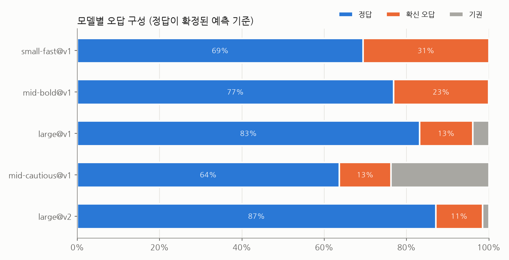
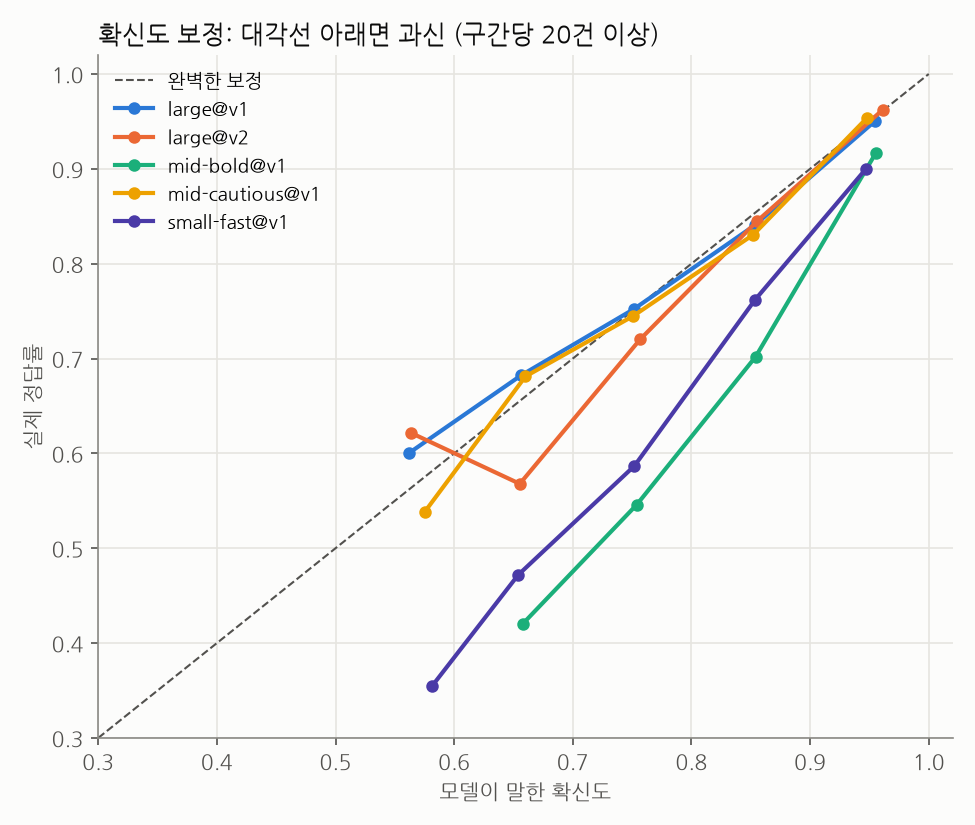
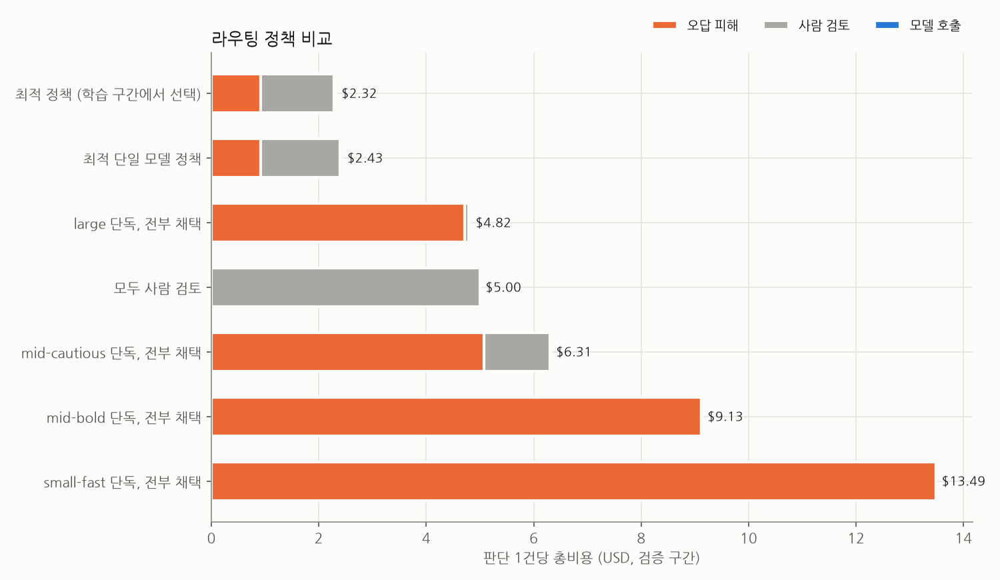

# LLM 판단 신뢰도 리포트 (가상 데이터)

> 시뮬레이션 데이터로 만든 예시 리포트입니다. 모델 이름과 수치는 실제 제품과 무관합니다.

## 1. 오답 구성

| 모델 | 정답 확정 | 정답 대기 | 정답 | 확신 오답 | 확신 오답(축소 추정) | 기권 | 답했을 때 정답률 | 보정 오차(ECE) |
|---|---|---|---|---|---|---|---|---|
| large@v1 | 990 | 0.0% | 83.2% | 12.8% | 13.0% | 3.9% | 86.6% | 0.009 |
| large@v2 | 1786 | 11.1% | 87.1% | 11.4% | 11.5% | 1.5% | 88.5% | 0.013 |
| mid-bold@v1 | 2776 | 7.5% | 76.9% | 23.1% | 23.1% | 0.0% | 76.9% | 0.108 |
| mid-cautious@v1 | 2776 | 7.5% | 63.7% | 12.5% | 12.6% | 23.8% | 83.6% | 0.013 |
| small-fast@v1 | 2776 | 7.5% | 69.5% | 30.5% | 30.4% | 0.0% | 69.5% | 0.117 |

- **확신 오답(축소 추정)**: 표본이 적은 모델의 비율을 전체 평균 쪽으로 당긴 값 (경험적 베이즈).
- **ECE**: 모델이 말한 확신도와 실제 정답률의 평균 차이. 클수록 확신도를 라우팅 기준으로 쓰기 어렵습니다.

## 2. 확신도 보정

## 3. 기권이 타당했는가
기권한 문항에서 다른 모델들의 정답률이 평소보다 낮을수록, 실제로 어려운 문제에서 기권했다는 뜻입니다.

| 모델 | 기권 수 | 기권 문항에서 타 모델 정답률 | 타 모델 평소 정답률 | 비율 (낮을수록 타당) |
|---|---|---|---|---|
| large@v1 | 39 | 28.2% | 78.4% | 0.36 |
| large@v2 | 27 | 27.8% | 77.2% | 0.36 |
| mid-cautious@v1 | 660 | 54.3% | 78.0% | 0.70 |

## 4. 모델 간 오류 상관
같이 틀리는 모델끼리는 투표해도 이득이 작습니다.

| 모델 A | 모델 B | 공통 문항 | 오류 상관 | 둘 다 틀림 | 같은 오답 비율 |
|---|---|---|---|---|---|
| mid-bold@v1 | small-fast@v1 | 2776 | 0.18 | 10.6% | 55.6% |
| large@v2 | mid-bold@v1 | 1759 | 0.16 | 4.8% | 54.1% |
| large@v1 | mid-cautious@v1 | 748 | 0.14 | 2.9% | 54.5% |
| large@v2 | small-fast@v1 | 1759 | 0.13 | 5.5% | 55.2% |
| large@v1 | mid-bold@v1 | 951 | 0.11 | 4.2% | 60.0% |
| mid-bold@v1 | mid-cautious@v1 | 2116 | 0.10 | 3.7% | 63.3% |
| large@v2 | mid-cautious@v1 | 1368 | 0.09 | 1.8% | 54.2% |
| mid-cautious@v1 | small-fast@v1 | 2116 | 0.09 | 5.2% | 58.7% |
| large@v1 | small-fast@v1 | 951 | 0.04 | 4.2% | 52.5% |

## 5. 호출 1회당 기대 손실 (USD)

| 모델 | 표본 | 오답 피해 | 기권→사람 검토 | 호출 비용 | 기대 손실 |
|---|---|---|---|---|---|
| large@v2 | 1786 | $4.42 | $0.08 | $0.030 | $4.52 |
| large@v1 | 990 | $5.06 | $0.20 | $0.030 | $5.29 |
| mid-cautious@v1 | 2776 | $4.80 | $1.19 | $0.008 | $6.00 |
| mid-bold@v1 | 2776 | $9.23 | $0.00 | $0.008 | $9.24 |
| small-fast@v1 | 2776 | $12.34 | $0.00 | $0.002 | $12.34 |

## 6. 라우팅 정책
앞 70% 기간(1250건)에서 정책을 고르고, 뒤 30% 기간(536건)에서 검증했습니다. 모델마다 최신 버전 데이터만 사용했습니다.

| 정책 구분 | 정책 | 총비용/건 | 오답 피해 | 사람 검토 | 모델 호출 | 사람에게 넘긴 비율 | 틀린 채택 비율 |
|---|---|---|---|---|---|---|---|
| 최적 정책 (학습 구간에서 선택) | large(≥0.80) → mid-bold(≥0.95) +근거검증 → 사람 | $2.32 | $0.91 | $1.37 | $0.032 | 27.4% | 2.6% |
| 최적 단일 모델 정책 | large(≥0.80) +근거검증 → 사람 | $2.43 | $0.91 | $1.48 | $0.030 | 29.7% | 2.6% |
| large 단독, 전부 채택 | large(≥0.00) → 사람 | $4.82 | $4.72 | $0.07 | $0.030 | 1.3% | 11.9% |
| 모두 사람 검토 | (모델 없음) → 사람 | $5.00 | $0.00 | $5.00 | $0.000 | 100.0% | 0.0% |
| mid-cautious 단독, 전부 채택 | mid-cautious(≥0.00) → 사람 | $6.31 | $5.07 | $1.23 | $0.008 | 24.6% | 12.3% |
| mid-bold 단독, 전부 채택 | mid-bold(≥0.00) → 사람 | $9.13 | $9.12 | $0.00 | $0.008 | 0.0% | 23.9% |
| small-fast 단독, 전부 채택 | small-fast(≥0.00) → 사람 | $13.49 | $13.49 | $0.00 | $0.002 | 0.0% | 34.9% |

### 학습 구간 상위 정책 10개

| 정책 | 총비용/건 | 사람 비율 | 틀린 채택 |
|---|---|---|---|
| large(≥0.80) → mid-bold(≥0.95) +근거검증 → 사람 | $2.18 | 27.4% | 2.2% |
| large(≥0.80) → small-fast(≥0.90) +근거검증 → 사람 | $2.19 | 27.6% | 2.2% |
| large(≥0.80) → mid-cautious(≥0.70) +근거검증 → 사람 | $2.20 | 23.8% | 2.7% |
| large(≥0.50) → mid-bold(≥0.95) +근거검증 → 사람 | $2.21 | 14.3% | 4.3% |
| large(≥0.80) → mid-bold(≥0.90) +근거검증 → 사람 | $2.22 | 24.6% | 2.5% |
| large(≥0.80) → mid-bold(≥0.80) +근거검증 → 사람 | $2.22 | 21.8% | 3.0% |
| large(≥0.50) → small-fast(≥0.90) +근거검증 → 사람 | $2.23 | 14.5% | 4.4% |
| large(≥0.00) → mid-bold(≥0.95) +근거검증 → 사람 | $2.24 | 14.2% | 4.4% |
| large(≥0.50) → mid-cautious(≥0.70) +근거검증 → 사람 | $2.24 | 10.6% | 4.9% |
| large(≥0.80) → small-fast(≥0.95) +근거검증 → 사람 | $2.24 | 28.6% | 2.2% |
