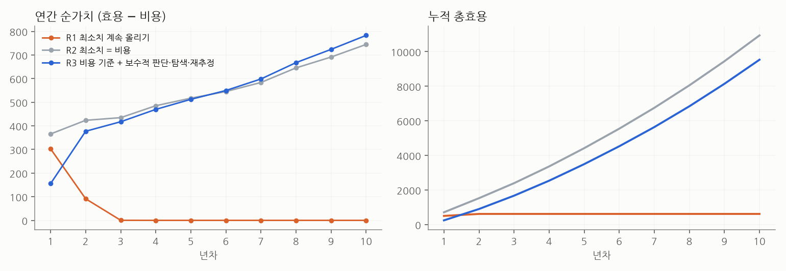
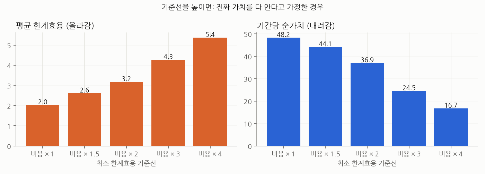

# 한계효용 규칙 세 가지 비교

가상 환경 30개 × 10년(120개월). 선택지마다 한 달에 n번째 단위의 가치가 0.8배씩 줄고(체감), 단위마다 비용 1이 듭니다. 선택지의 가치는 조금씩 변하고 대체로 낡으며, 새 선택지가 평균 10개월마다 생깁니다. **그래서 시간이 갈수록 기회의 총량이 늘어납니다.** 실제 효용은 잡음이 섞여 관측되고, 규칙은 관측값으로 가치를 추정합니다. 숫자는 제가 정한 가정에서 나온 것이라 방향과 크기 비교로만 읽어 주세요.

| 규칙 | 실행 조건 |
|---|---|
| R1 최소치 계속 올리기 | 추정 한계효용 ≥ 기준선. 기준선은 매달 '지난달 실행한 것 중 하위 10%' 이상으로 올라가고 내려가지 않음 |
| R2 최소치 = 비용 | 추정 한계효용 ≥ 비용 |
| R3 R2 + 보수적 판단·탐색·재추정 | 추정치 − 불확실성 ≥ 비용일 때만 실행, 단위의 10%는 불확실성이 큰 선택지 시험, 최근 관측에 더 큰 가중치 |

## 1. 결과

| 규칙 | 기간당 순가치 | 평균 한계효용 | 최소 한계효용 | 기간당 실행 단위 | 가능한 순가치 중 얻은 비율 | 새 선택지 시험 비율 |
|---|---|---|---|---|---|---|
| R1 최소치 계속 올리기 | 3.3 | 3.42 | 2.31 | 1.9 | 9% | 25% |
| R2 최소치 = 비용 | 45.3 | 1.93 | 0.67 | 45.9 | 93% | 100% |
| R3 비용 기준 + 보수적 판단·탐색·재추정 | 43.8 | 2.17 | 0.80 | 35.7 | 85% | 97% |

- **R1은 평균(3.42)과 최소치(2.31)가 가장 높지만 순가치는 R2의 7%입니다.** 기준선이 2년 만에 비용의 5배 넘게 올라가 거의 아무것도 하지 않게 되고, 새로 생긴 선택지의 75%를 한 번도 시험하지 않습니다.
- R2와 R3는 가능한 순가치의 93%·85%를 얻습니다.

## 2. '총효용은 어차피 늘어난다'는 가정

- R2·R3에서는 맞습니다. 연간 총효용이 1년차 711 → 10년차 1,493 (R2)로 기회가 늘어난 만큼 커집니다. **그래서 10년 전과 지금의 누적 총효용을 비교하는 것은 의미가 없다는 판단은 옳습니다.**
- 하지만 R1에서는 틀립니다. 연간 총효용이 1년차 502 → 3년차 0로 사라집니다. **총효용이 늘어나는 것은 저절로가 아니라, 늘어난 기회를 실제로 붙잡는 규칙일 때만입니다.**
- 그래서 시간을 넘어 비교할 지표로는 누적 총효용 대신 **'그 기간에 얻을 수 있었던 순가치 중 실제로 얻은 비율'**이 좋습니다. 기회의 총량이 늘어나도 비교 기준이 같이 늘어나기 때문에 10년 전과 지금을 공정하게 비교할 수 있습니다.

## 3. 기준선을 높이면 생기는 일

추정 문제를 없애기 위해 진짜 가치를 안다고 가정하고 기준선만 바꿨습니다.

| 기준선 | 기간당 순가치 | 평균 한계효용 | 최소 한계효용 | 얻은 비율 |
|---|---|---|---|---|
| 비용 × 1 | 48.2 | 2.02 | 1.02 | 100% |
| 비용 × 1.5 | 44.1 | 2.61 | 1.54 | 89% |
| 비용 × 2 | 36.9 | 3.17 | 2.07 | 70% |
| 비용 × 3 | 24.5 | 4.27 | 3.19 | 41% |
| 비용 × 4 | 16.7 | 5.36 | 4.32 | 25% |

- 기준선을 올릴수록 평균과 최소치는 오르고 순가치는 줄어듭니다. **평균효용을 목표로 삼으면 실제 이득과 반대로 움직입니다.** 순가치가 가장 큰 기준선은 비용과 같을 때입니다.
- 추정해야 하는 실제 상황에서는 더 나쁩니다. 기준선을 비용의 2배로 고정하면 순가치 0.0, 새 선택지 시험 0%. 처음 보는 선택지의 추정치(평균 수준)가 기준선보다 낮아 한 번도 시험하지 않고, 그래서 영원히 배우지 못합니다 (1.5배는 순가치 39.6).

## 4. R2 vs R3: 처음엔 R2, 시간이 지나면 R3

- 1~4년차 R3 − R2 월평균 순가치 차이: -6.0 (95% 구간 -6.9 ~ -5.1)
- 6~10년차: +1.9 (95% 구간 +1.0 ~ +2.9)
- R3는 처음에 불확실한 선택지를 보수적으로 피해서 손해를 봅니다. 대신 탐색과 재추정 덕분에 낡은 선택지를 빨리 줄이고 새 선택지를 잘 잡아, 시간이 지날수록 앞섭니다. R2는 누적 평균으로 추정해 이미 낡은 선택지를 계속 실행합니다.

## 결론: 규칙을 이렇게 바꾸면 더 합리적

1. **기준선(최소 한계효용) = 비용(기회비용)**. 그보다 올리면 평균은 좋아 보여도 실제 이득이 줄어듭니다.
2. **판단은 보수적으로, 일부는 탐색**. 처음 보는 기회를 시험하지 않으면 기준선이 높을수록 영원히 배우지 못합니다.
3. **최근 관측에 더 무게를 두고 재추정**. 기회의 가치는 변합니다.
4. **시간 비교 지표는 '얻을 수 있었던 순가치 중 얻은 비율'**. 누적 총효용은 비교에 쓰지 않는다는 판단은 옳고, 평균효용 대신 이 비율을 쓰면 됩니다.

## 한계

- 가상 환경입니다. 체감률 0.8, 비용 1, 잡음, 새 선택지 빈도는 제가 정한 값이고 바꾸면 크기는 달라집니다. 방향(평균↑ 순가치↓, 탐색 없는 높은 기준선의 실패)은 이 가정들에 크게 의존하지 않습니다.
- R3의 탐색 비율(10%)과 보수성(1 표준편차)은 조정하지 않은 기본값입니다.