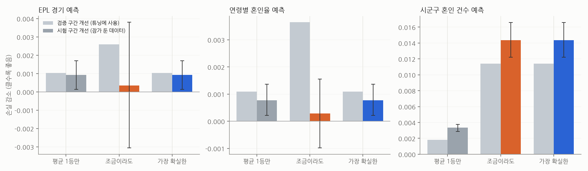

# 점진 개선 실험: 규칙을 하나씩 바꿔 모델 성능 올리기

모델 3개를 같은 실험대에 올렸습니다. 데이터를 시간 순서로 **학습 → 검증 → 시험**으로 나누고, 규칙(파라미터)을 한 번에 하나씩 바꿔 **검증 구간**에서 좋아지면 채택합니다. 시험 구간은 끝에서 한 번만 엽니다. 채택 방식 세 가지를 비교했습니다.

| 채택 방식 | 내용 |
|---|---|
| 평균 1등만 확인 (1차 규칙) | 평균 개선이 가장 큰 후보 하나가 '확실히'(부트스트랩 95% 구간 > 0) 좋아질 때만 채택, 아니면 멈춤 |
| 조금이라도 좋으면 채택 | 평균이 조금이라도 좋아지면 채택 (흔한 방식) |
| 가장 확실한 개선부터 (최종 규칙) | 개선 95% 구간 하한이 가장 큰 후보를 고르고, 하한 > 0 일 때만 채택. 확실한 후보가 하나도 없을 때 멈춤 |

| 모델 | 데이터 | 학습 / 검증 / 시험 | 손실 |
|---|---|---|---|
| EPL 경기 예측 | openfootball 프리미어리그 2010/11~2026/27 결과 6,130경기 | 2010/11~2020/21 / 2021/22~2023/24 / 2024/25~2025/26 | RPS (순위 확률 점수) |
| 연령별 혼인율 예측 | KOSIS·e-Stat 한·일 연령별 혼인율 | 원점 ~2007 / 2008~2014 / 2015~2021 (1~3년 뒤) | |로그 오차| |
| 시군구 혼인 건수 예측 | KOSIS 시군구 연간 혼인 2005~2025 (243곳) | 원점 ~2012 / 2013~2016 / 2017~2023 (1~2년 뒤) | |로그 오차| |

## 1. 결과

| 모델 | 채택규칙 | 채택 수 | 시도 수 | 검증 개선 | 시험 개선 | 시험 95% 하한 | 시험 95% 상한 | 바뀐규칙 |
|---|---|---|---|---|---|---|---|---|
| EPL 경기 예측 | 평균 1등만 확인 (1차 규칙) | 1 | 18 | 0.0010 | +0.0009 | +0.0001 | +0.0017 | k=0.04, h=0.25, c=0.8, p=-0.2, rho=0.0 |
| EPL 경기 예측 | 조금이라도 좋으면 채택 | 5 | 51 | 0.0026 | +0.0003 | -0.0031 | +0.0038 | k=0.02, h=0.25, c=1.0, p=-0.2, rho=0.0 |
| EPL 경기 예측 | 가장 확실한 개선부터 (최종 규칙) | 1 | 18 | 0.0010 | +0.0009 | +0.0001 | +0.0017 | k=0.04, h=0.25, c=0.8, p=-0.2, rho=0.0 |
| 연령별 혼인율 예측 | 평균 1등만 확인 (1차 규칙) | 1 | 16 | 0.0011 | +0.0008 | +0.0002 | +0.0014 | drift_k=5, lam=1.0, wp=0.2, s=1.0 |
| 연령별 혼인율 예측 | 조금이라도 좋으면 채택 | 3 | 31 | 0.0036 | +0.0003 | -0.0010 | +0.0016 | drift_k=5, lam=1.0, wp=0.0, s=0.75 |
| 연령별 혼인율 예측 | 가장 확실한 개선부터 (최종 규칙) | 1 | 16 | 0.0011 | +0.0008 | +0.0002 | +0.0014 | drift_k=5, lam=1.0, wp=0.2, s=1.0 |
| 시군구 혼인 건수 예측 | 평균 1등만 확인 (1차 규칙) | 1 | 11 | 0.0018 | +0.0033 | +0.0029 | +0.0038 | k=5, alpha=0.25, s=1.0, beta=0.0 |
| 시군구 혼인 건수 예측 | 조금이라도 좋으면 채택 | 6 | 38 | 0.0114 | +0.0144 | +0.0122 | +0.0166 | k=2, alpha=1.0, s=1.0, beta=0.0 |
| 시군구 혼인 건수 예측 | 가장 확실한 개선부터 (최종 규칙) | 6 | 38 | 0.0114 | +0.0144 | +0.0122 | +0.0166 | k=2, alpha=1.0, s=1.0, beta=0.0 |

- **'조금이라도 좋으면 채택'은 검증 점수를 가장 많이 올리지만, 축구·혼인율에서는 시험에서 효과가 대부분 사라졌습니다** (95% 구간이 0을 포함). 검증 구간에 맞춰진 것입니다.
- **1차 규칙(평균 1등만 확인)은 시군구 모델에서 너무 일찍 멈췄습니다.** 2단계의 평균 1등 후보가 불확실해서 멈췄는데, 그 뒤에 확실하고 큰 개선(시도 추세에 더 기대기)이 있었습니다.
- **최종 규칙(가장 확실한 개선부터)은 세 모델 모두에서 시험 성능이 가장 좋았거나 공동 1위**였습니다.
- 주의: 최종 규칙은 1차 규칙의 시험 결과를 보고 고친 것이라, 위 시험 구간은 이 비교에서 더 이상 깨끗하지 않습니다. 깨끗한 확인은 아래 축구 이번 시즌 경기와, 앞으로 나올 데이터로 합니다.

### 시군구 모델에서 채택된 순서 (최종 규칙)

| 단계 | 바꾼 규칙 | 검증 손실 | 개선 | 95% 하한 | 95% 상한 |
|---|---|---|---|---|---|
| 0 | 시작 | 0.0966 | 0.0000 | - | - |
| 1 | alpha: 0.0 → 0.25 | 0.0948 | 0.0018 | 0.0013 | 0.0023 |
| 2 | alpha: 0.25 → 0.5 | 0.0937 | 0.0010 | 0.0005 | 0.0016 |
| 3 | k: 5 → 3 | 0.0897 | 0.0041 | 0.0028 | 0.0053 |
| 4 | alpha: 0.5 → 0.75 | 0.0876 | 0.0021 | 0.0014 | 0.0028 |
| 5 | k: 3 → 2 | 0.0865 | 0.0011 | 0.0002 | 0.0019 |
| 6 | alpha: 0.75 → 1.0 | 0.0852 | 0.0013 | 0.0004 | 0.0022 |

- 작은 시군구는 해마다 숫자가 크게 출렁여서, **자기 추세보다 소속 시도의 추세를 따르는 편(alpha=1)이 더 정확**했습니다. 추세는 최근 2년만 보는 게 가장 좋았습니다.

## 2. 깨끗한 확인: 2026/27 시즌 50경기 (튜닝에 쓰지 않은 데이터)

| 규칙 | RPS | 시작 대비 | 95% 구간 |
|---|---|---|---|
| 시작 규칙 | 0.2038 | - |  |
| 평균 1등만 확인 (1차 규칙) | 0.2017 | +0.0021 | -0.0006 ~ +0.0049 |
| 조금이라도 좋으면 채택 | 0.2073 | -0.0035 | -0.0231 ~ +0.0155 |
| 가장 확실한 개선부터 (최종 규칙) | 0.2017 | +0.0021 | -0.0006 ~ +0.0049 |

- 방향은 시험 구간과 같습니다: 최종 규칙이 가장 좋고, '조금이라도 좋으면 채택'은 시작 규칙보다도 나빴습니다. 다만 50경기라 차이가 통계적으로 확실하지는 않습니다. 경기가 쌓이면 다시 잽니다.
- 기준선(홈·무·원정 비율만 사용) RPS 0.2281보다는 모두 낫습니다.

## 3. 맨유 2026/27

### 치른 경기 (경기 전 예측)

| 경기 | 예측 홈 승 | 예측 무 | 예측 원정 승 |
|---|---|---|---|
| 2026-08-22 Hull City 2-0 Manchester United | 29% | 24% | 47% |
| 2026-08-30 Manchester United 5-2 Ipswich Town | 72% | 16% | 12% |
| 2026-09-06 Everton 2-2 Manchester United | 37% | 25% | 39% |
| 2026-09-13 Manchester United 0-1 Manchester City | 36% | 24% | 40% |
| 2026-09-20 Fulham 1-1 Manchester United | 31% | 25% | 43% |

### 남은 경기 예측 (2026-10-04 기준, 최종 규칙)

| 경기 | 홈 승 | 무 | 원정 승 | 홈 기대골 | 원정 기대골 |
|---|---|---|---|---|---|
| 2026-10-10 Manchester United vs Tottenham Hotspur | 67% | 19% | 14% | 2.17 | 0.89 |
| 2026-10-18 Leeds United vs Manchester United | 41% | 26% | 33% | 1.43 | 1.26 |
| 2026-10-25 Manchester United vs Bournemouth | 50% | 23% | 26% | 1.78 | 1.22 |
| 2026-10-31 Chelsea vs Manchester United | 35% | 22% | 43% | 1.67 | 1.85 |
| 2026-11-07 Manchester United vs Aston Villa | 58% | 21% | 21% | 2.09 | 1.19 |
| 2026-11-21 Liverpool vs Manchester United | 44% | 24% | 32% | 1.63 | 1.37 |
| 2026-11-28 Manchester United vs Brentford | 47% | 24% | 30% | 1.70 | 1.31 |
| 2026-12-02 Newcastle United vs Manchester United | 39% | 23% | 39% | 1.70 | 1.70 |
| 2026-12-05 Manchester United vs Coventry City | 73% | 16% | 10% | 2.41 | 0.80 |
| 2026-12-12 Crystal Palace vs Manchester United | 27% | 23% | 49% | 1.27 | 1.78 |

- 예측은 `data_epl/predictions_2026-10-04.csv`에 저장했습니다 (이번 시즌 남은 전 경기). 결과가 나오면 채점해 보정 기록을 공개합니다.
- 먼 경기일수록 그 사이 결과를 모르는 상태의 예측이라 덜 정확합니다. 매 라운드 다시 예측하는 게 원칙입니다.

## 한계

- 축구 자료는 골 결과뿐입니다 (부상, 이적, 감독 교체, 기대득점, 배당률 없음). 북메이커 배당과 비교하지 못했습니다. 실제로 이기려면 배당보다 나아야 하는데, 이 모델은 그 수준이 아닐 가능성이 큽니다.
- 시험 구간의 항목들은 서로 독립이 아닙니다 (같은 팀, 같은 지역이 여러 번 나옴). 그래서 95% 구간은 실제보다 좁게 나왔을 수 있습니다.
- 모델 세 개는 일부러 단순하게 만들었습니다. 규칙 튜닝으로 얻는 개선은 손실의 0.4~10% 수준이고, 큰 개선은 새 정보(배당, 선수 정보, 월별 통계)에서 옵니다.